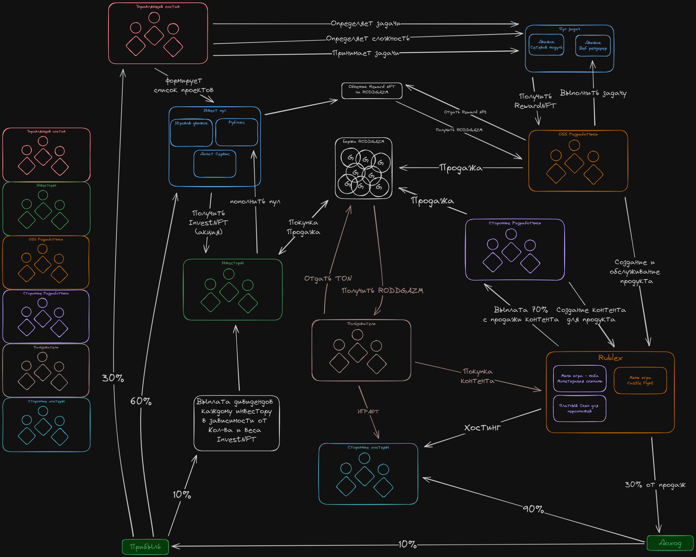

## RODDGAZM Profile

  

  <svg width="600px" viewBox="0 0 600 200" style="position: absolute; display: block; border-radius: 10px">
    <defs>
      <mask id="cutout-mask">
        <rect width="600" height="200" fill="white"/>
        <circle cx="300" cy="230" r="74" fill="black"/>
      </mask>
    </defs>
    <image href="assets/banner.png" width="600px" mask="url(#cutout-mask)"/>
  </svg>

  

  

  

    
      RODDGAZM
    

  
Get your roddgazm here

  

  

## Принцип замкнутой токеномики для RODDGAZM

`Управляющий состав` разрабатывает идеи проектов и формирует сбор средств под каждый.

`Инвестор` голосует за определенный проект путем покупки `InvestNFT` за `RODDGAZM`. Он видит общую сумму в пуле и понимает какую долю от выплаты дивидендов он получит.

`Управляющий состав` формирует список задач для проекта победившего в голосовании.

`OpenSource разработчик` выполняет задачи получая `RewardNFT`. В дальнейшем он может обменять `RewardNFT` на `RODDGAZM`.

`Сторонние разработчики` могут внести свой вклад в любой проект бесплатно. Но они могут монетизироваться с продажи своего контента получая 70% с каждой продажи.

`Сторонние хостеры` могут использовать проект для хостинга своих собственных серверов. Они сами занимаются привлечением `игроков` на свои сервера и получают 90% от прибыли с продаж на их сервере.

На старте проект сам является своим же `хостером`.

Пользователи приобретают `RODDGAZM` с биржи или у других пользователей и используют их для получения внутриигрового контента.

### Распределение прибыли проекта:
- 10% уходит `инвесторам` как дивиденды
- 30% уходит в `управляющий состав`
- 60% уходит на реинвестирование в проекты